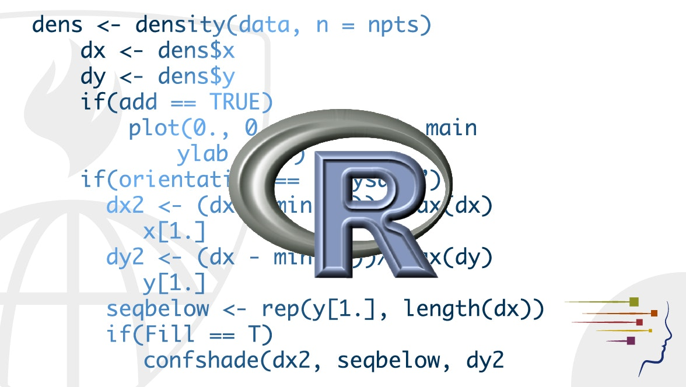

# DACSS 601 - Data Science Fundamentals

## Overview

This repository contains solved challenges for **[DACSS 601 - Data Science Fundamentals](https://www.coursicle.com/umass/courses/DACSS/601/)**, an asynchronous course offered at the University of Massachusetts Amherst. The course introduces students to the R programming language, covering foundational topics in data management, wrangling, and visualization. Students will learn essential skills to handle data effectively and communicate insights, preparing them for advanced methods projects in Industry.

## List of Topics with Readings

### Module 1: Introduction to R Programming and Data Management
1. **Class Introduction, R, RStudio, and Quarto**  
   - **Readings**:  
     - R Cookbook Ch 1.1–1.10  
     - R Cookbook Ch 3.1–3.10  
     - Quarto Overview (R4DS Ch 28)  

2. **Basic R Commands and Data Structures**  
   - **Readings**:  
     - R4DS Ch 2  
     - R Cookbook Ch 2.1–2.14  
     - R Help Pages Overview  

3. **Importing and Describing Datasets**  
   - **Readings**:  
     - R4DS Ch 3, Ch 7.2  
     - Tidyverse Documentation: dplyr, readr  

4. **Data Wrangling and Transformation**  
   - **Readings**:  
     - R4DS Ch 5, Ch 16, Ch 17  
     - Tidyverse Documentation: forcats, lubridate  

### Module 2: Introduction to Visualization
5. **Basics of Visualization with ggplot2**  
   - **Readings**:  
     - R4DS Ch 9  
     - R Graph Gallery: Barplot, Grouped/Stacked Barplot, Scatter Plot  

6. **Graph Customization and Alt Text**  
   - **Readings**:  
     - R4DS Ch 10, Ch 11  
     - R Graph Gallery: ggplot2 Colors  
     - Writing Alt Text for Data Visualization  

7. **Visualizing Time Series and Spatial Data**  
   - **Readings**:  
     - R Graph Gallery: Time-series Visualizations  
     - R Graph Gallery: Maps  

### Module 3: Data Analysis: Principles, Topics, and Practice
8. **Data Science Ethics**  
   - **Readings**:  
     - Modern Data Science with R Ch 8  

9. **Creating Compelling Narratives with Data**  
   - **Readings**:  
     - Miller 2005 Ch 2 & Ch 5  

10. **Designing and Managing Data Science Projects**  
    - **Readings**:  
      - Happy Git with R Ch 1, 4, 9–12 

## Challenges/Tasks
| Challenge   | Description                                                         | Link                                     |
|-------------|---------------------------------------------------------------------|-----------------------------------------------|
| Challenge 1 | Data Import, Description, and Transformation                       | [View HTML](./Challenge%201/challenge1_f24_vgudi.html) |
| Challenge 2 | Data Transformation, Pivoting, and Date-Time Data                  | [View HTML](./Challenge%202/challenge2_f24_vgudi.html) |
| Challenge 3 | Joining Relational Data, Writing Your Own Functions, and String Operations | [View HTML](./Challenge%203/challenge3_f24_vgudi.html) |
| Challenge 4 | Intro to Visualization: Univariate and Multivariate Graphs         | [View HTML](./Challenge%204/challenge4_f24_vgudi.html) |
| Challenge 5 | Visualizing Time and Space                                         | [View HTML](./Challenge%205/challenge5_f24_vgudi.html) |
| Challenge 6 | Basic Principles of Data-Driven Storytelling                       | [View HTML](./Challenge%206/challenge6_f24_vgudi.html) |
| Challenge 7 | Concepts and Practices of Research Design for a Data Science Project | [View HTML](./Challenge%207/challenge7_f24_vgudi.html) |

----

- *Credits to UMass Amherst, Prof. Simon Hoellerbauer*
- *Contributed by Vara Prasad Gudi*